# Information Management System

The Inventory Management System of the D'Baesic Apparel e-commerce, developed using HTML5, CSS, Bootstrap, jQuery, Java, Spring Boot, Thymeleaf, and OpenAPI documentation, encompasses the organization, tracking, and optimization of product stock, ensuring efficient supply chain management and seamless customer order fulfillment.

## Features

- **Product Management:** Easily manage products including adding, updating, and deleting product information.
- **Sales Reporting:** Generate detailed sales reports to analyze performance and track revenue.
- **User Management:** Manage user accounts with role-based access control for enhanced security.
- **Color and Size Management:** Efficiently manage product variations by color and size.
- **Authentication and Authorization:** Secure user authentication and authorization mechanisms.
- **API Documentation:** Interactive API documentation using OpenAPI for easy integration and understanding.

## Technologies Used

- **Frontend:** HTML5, CSS, Bootstrap, jQuery
- **Backend:** Java, Spring Boot, Thymeleaf
- **Database:** MySQL, Hibernate ORM
- **API Documentation:** OpenAPI

## Installation

1. Clone the repository: `git clone https://github.com/your-username/your-repo.git`
2. Navigate to the project directory: `cd your-repo`
3. Build the project: `mvn clean install`
4. Run the application: `mvn spring-boot:run`

Make sure you have Java and Maven installed on your system.

## Usage

1. Access the application through the browser at `http://localhost:8080`
2. Log in using your credentials or sign up if you're a new user.
3. Explore the dashboard to manage products, view sales reports, and perform other operations.

## API Documentation

The API documentation can be accessed at `http://localhost:8080/swagger-ui.html` after running the application.

## Contributing

Contributions are welcome! Please fork the repository and create a pull request for any enhancements or bug fixes.

## Project Images

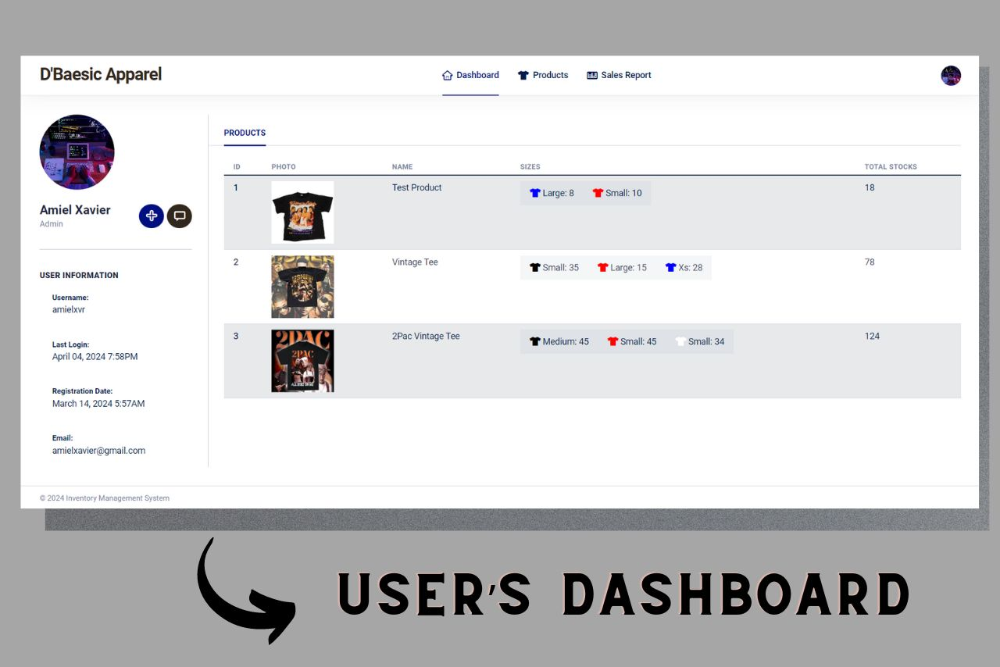
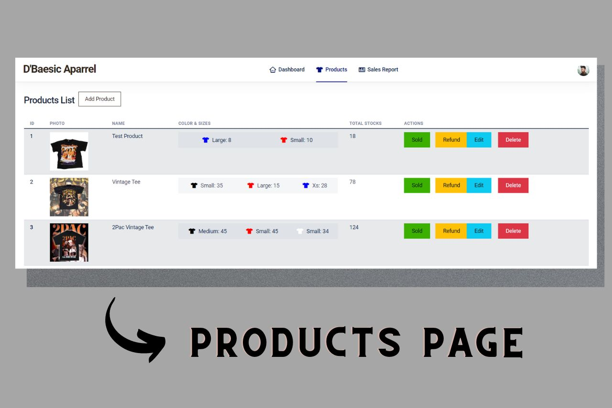
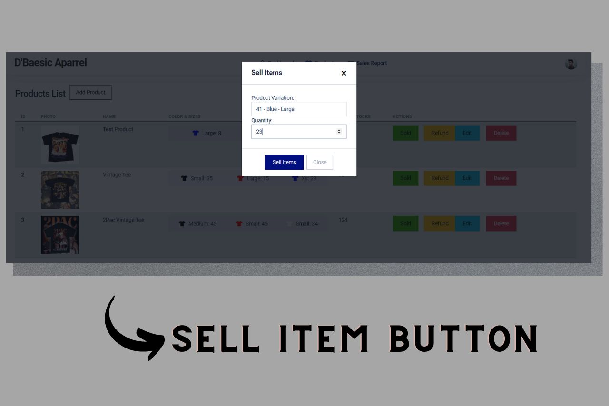
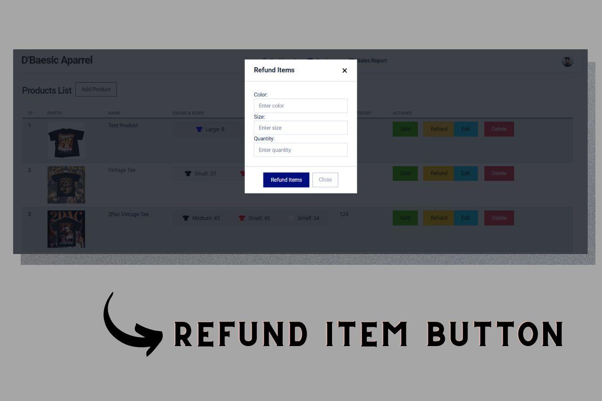
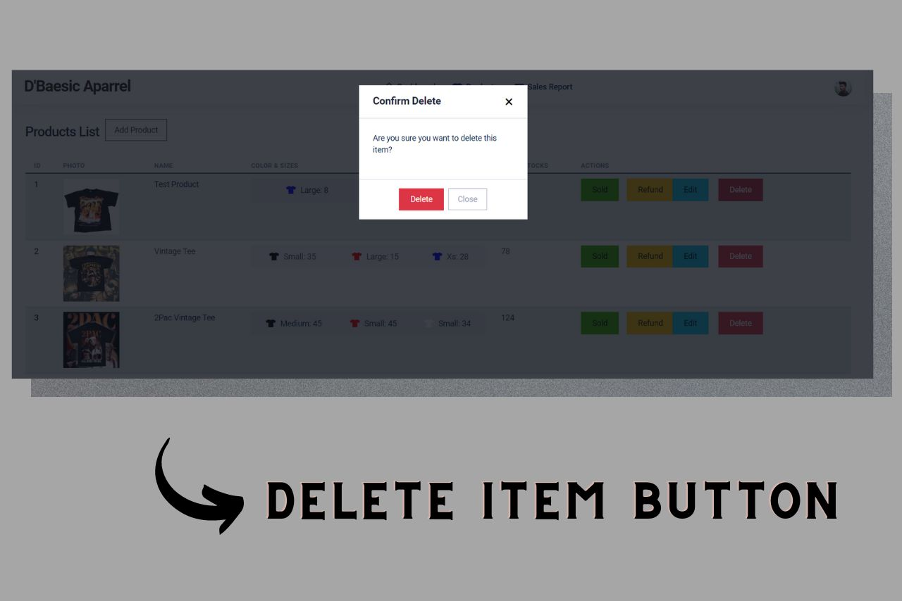
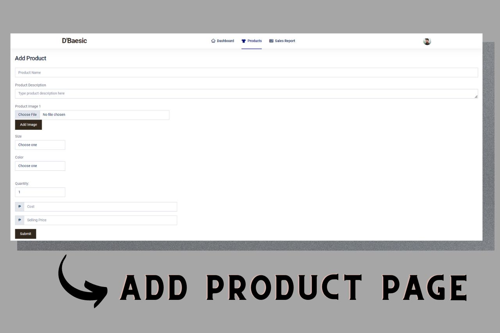
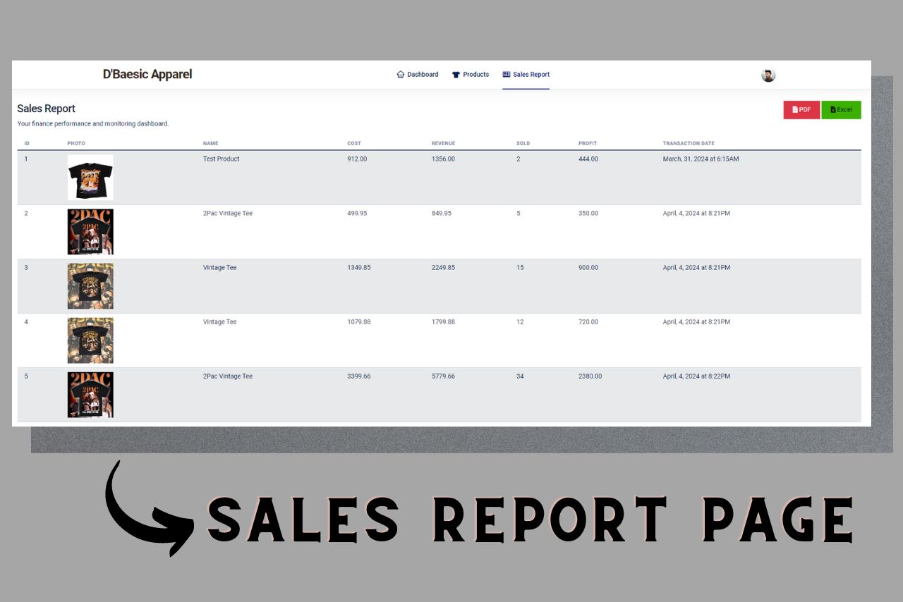

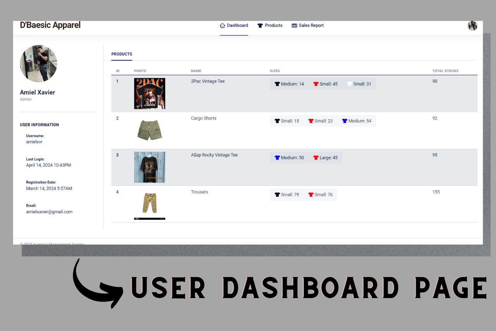
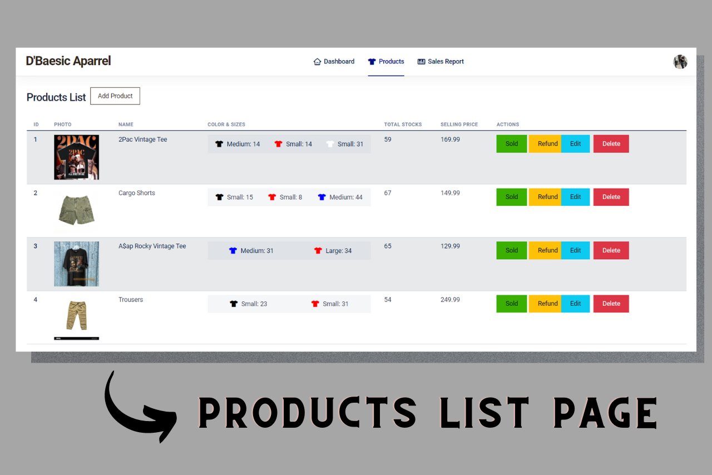
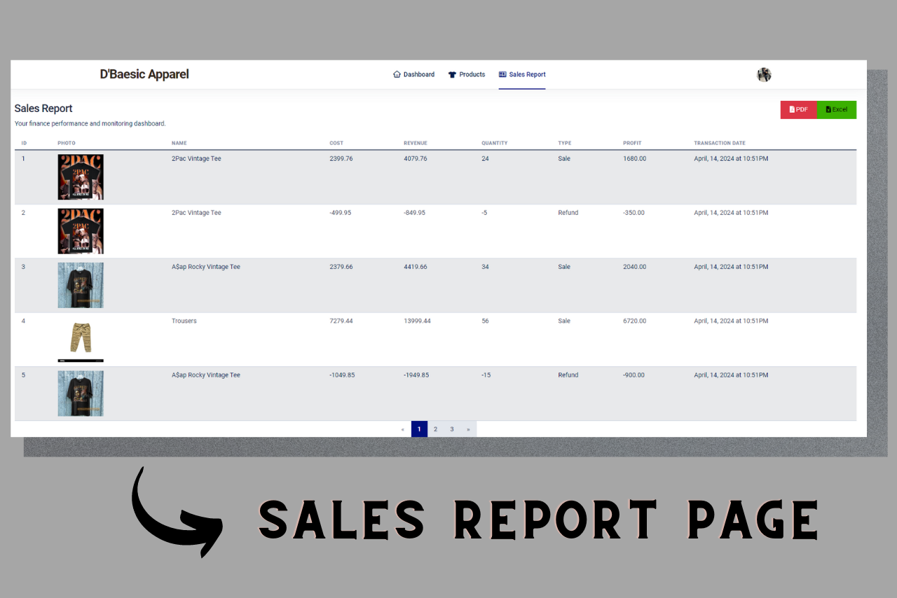

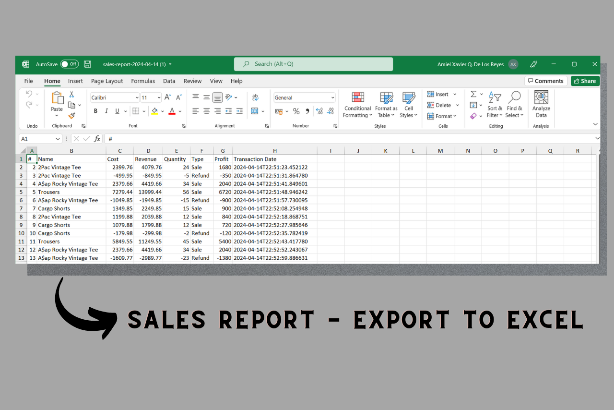

